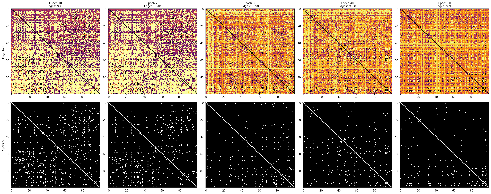

# SRCG: Self-Reflexive Cognitive Graph

A neural architecture that dynamically modifies its graph structure based on task performance, enabling self-improvement through reward-modulated structural plasticity.

## Overview

SRCG (Self-Reflexive Cognitive Graph) is a novel neural system that combines:
- **Gradient-based learning** for node parameters
- **Non-gradient structural plasticity** for graph topology
- **Reward-driven adaptation** that modifies connections based on task success

Unlike traditional neural networks with fixed architectures, SRCG's graph structure evolves during training, allowing it to self-organize and adapt to increasingly complex tasks.

## Key Features

### 1. Dynamic Graph Structure
The adjacency matrix (edge weights) is not learned via gradients but updated through reward-modulated plasticity rules. Edges are added, pruned, and strengthened based on:
- Node activation correlations
- Task reward signals
- Structural efficiency metrics

### 2. Stable Message Passing
Damped iterative reasoning prevents instability:

$$H_{t+1} = (1-\alpha) H_t + \alpha \text{ReLU}(H_t W_{\text{self}} + A^T H_t)$$

Where $\alpha = 0.5$ provides stable convergence.

### 3. Dual Learning Mechanism
- **Gradient-based**: Node transformation matrices and output head
- **Plasticity-based**: Graph structure (edges) via Hebbian-reward updates

### 4. Self-Improvement Verification Framework (SIVF)
Built-in metrics to empirically validate self-organization:
- **Graph Entropy**: Measures structural organization
- **Motif Reuse**: Tracks pattern learning and stability
- **Structural Efficiency**: Reward per edge (intelligence density)

## Architecture

```
                    ┌─────────────┐
                    │   Input     │
                    │  Encoder    │
                    └──────┬──────┘
                           │
                    ┌──────▼──────┐        ┌───────────────┐
                    │   SRCG      │◄───────►│  Structural  │
                    │ Core Graph  │ Reward  │   Policy     │
                    │ (Reasoning) │         │ (Plasticity) │
                    └──────┬──────┘         └──────────────┘
                           │
                    ┌──────▼──────┐
                    │   Output    │
                    │    Head     │
                    └─────────────┘
```

## Algorithm

SRCG operates through three main phases: **Reasoning**, **Reward Computation**, and **Structural Plasticity**. Here's how it works:

### Phase 1: Forward Pass (Reasoning)

For each input batch:

1. **Encoding**: Input $x \in \mathbb{R}^{B \times d_{in}}$ is encoded into initial node states:
   $$H_0 = \text{Encoder}(x) \in \mathbb{R}^{B \times N \times d}$$
   where $N$ is the number of nodes and $d$ is the node dimension.

2. **Iterative Message Passing**: For $t = 0, 1, \ldots, T_r-1$ reasoning steps:
   - **Message aggregation**: Each node receives messages from connected neighbors:
     $$M_t = A^T H_t$$
     where $A \in \mathbb{R}^{N \times N}$ is the adjacency matrix (edge weights).
   
   - **Node update**: Each node combines self-transformation with incoming messages:
     $$\hat{H}_{t+1} = \text{ReLU}(H_t W_{\text{self}} + M_t)$$
     where $W_{\text{self}}$ is a learnable linear transformation.
   
   - **Damped update**: Stabilizes the dynamics:
     $$H_{t+1} = (1-\alpha) H_t + \alpha \hat{H}_{t+1}$$
     where $\alpha = 0.5$ is the damping coefficient.

3. **Output**: Final node states are pooled and mapped to predictions:
   $$h_{\text{pooled}} = \frac{1}{N}\sum_{i=1}^{N} H_{T_r}[i]$$
   $$y_{\text{pred}} = \text{OutputHead}(h_{\text{pooled}})$$

### Phase 2: Reward Computation

After the forward pass, a reward signal is computed based on task performance and structural costs:

$$R_k = S_k - \lambda_1 C_{\text{energy}} - \lambda_2 C_{\text{inst}}$$

where:
- **Task success**: $S_k = 1 - L_{\text{task}}$ (normalized task loss)
- **Energy cost**: $C_{\text{energy}} = \frac{1}{N^2}\sum_{i,j} |A_{ij}|$ (graph energy)
- **Instability cost**: $C_{\text{inst}} = \frac{1}{B}\sum_{b} \|H_{T_r}[b] - H_{T_r-1}[b]\|_2$ (node movement)

The reward $R_k$ is **positive** when the model performs well with minimal structural overhead, and **negative** when penalties outweigh task success.

### Phase 3: Structural Plasticity Update

The graph structure $A$ is updated using **reward-modulated Hebbian plasticity** (non-gradient operation):

#### 3.1 Edge Weight Updates

For each existing edge $A_{ji}$ (from node $j$ to node $i$):

1. Compute **node correlation**:
   $$s_{ji} = H_j^T H_i$$
   (dot product of node activation vectors)

2. Apply **Hebbian-reward update**:
   $$\Delta A_{ji} = \eta_w \cdot R_k \cdot s_{ji}$$
   $$A_{ji} \leftarrow \text{clip}(A_{ji} + \Delta A_{ji}, -w_{\max}, w_{\max})$$
   
   where $\eta_w = 0.01$ is the plasticity learning rate.

3. **Prune weak edges**: If $|A_{ji}| < \tau_{\text{prune}}$ (e.g., 0.02), set $A_{ji} = 0$.

#### 3.2 Edge Addition

New edges are added based on **high cosine similarity** between node pairs:

1. Compute normalized node states: $\hat{H}_i = \frac{H_i}{\|H_i\|_2}$
2. Compute cosine similarity matrix: $\text{sim} = \hat{H} \hat{H}^T$ (cosine similarity matrix)
3. For pairs $(i, j)$ with:
   - No existing edge: $|A_{ij}| < 10^{-6}$
   - High similarity: $\text{sim}_{i,j} > \tau_{\text{add}}$ (e.g., 0.8)
   - Under limit: fewer than `max_new_edges` added this step
   
   Add edge: $A_{ij} = 0.05 \cdot \text{sim}_{i,j}$

### Training Loop

The complete training process combines gradient-based and plasticity-based updates:

**For each batch:**

```python
# 1. Forward pass (reasoning)
y_pred, info = model(x)

# 2. Compute losses
task_loss = MSE(y_pred, y_true)
C_energy, C_inst = model.compute_structure_costs(...)
total_loss = task_loss + λ₁·C_energy + λ₂·C_inst

# 3. Gradient-based update (node parameters)
loss.backward()
optimizer.step()  # Updates: encoder, W_self, output_head

# 4. Plasticity-based update (graph structure)
with torch.no_grad():
    R_k = model.compute_reward(task_loss, C_energy, C_inst)
    model.update_structure(H_final, R_k)  # Updates: A (adjacency matrix)
```

**Key insight**: Node parameters (weights) learn via **gradients**, while graph structure (edges) learns via **reward-modulated plasticity**. This dual mechanism enables the model to self-organize its architecture based on task performance.

### Why This Works

1. **Stable Reasoning**: Damped message passing prevents divergence, allowing $T_r$ steps of iterative refinement.
2. **Reward Signal**: $R_k$ provides a global signal that correlates with task success, guiding structural changes.
3. **Hebbian Learning**: Edges strengthen when nodes co-activate ($s_{ji} > 0$) and task succeeds ($R_k > 0$), implementing Hebb's rule: "neurons that fire together, wire together."
4. **Adaptive Structure**: Graph grows/shrinks based on correlation patterns, creating efficient connectivity for the task.

## Installation

```bash
# Clone repository
git clone <repository-url>
cd SRCG

# Install dependencies
pip install -r requirements.txt
```

**Requirements:**
- Python 3.8+
- PyTorch 2.0+
- NumPy, PyYAML, Matplotlib, tqdm

## Quick Start

### Basic Training

```bash
# Train with default synthetic dataset
python train.py --config config.yaml --output-dir ./outputs

# Train with hierarchical progressive difficulty
python train.py --dataset hierarchical --progressive
```

### Programmatic Usage

```python
from srcg import SRCG
import torch

# Initialize model
model = SRCG(
    input_dim=32,
    output_dim=1,
    num_nodes=100,
    node_dim=128,
    reasoning_steps=20,
)

# Forward pass
x = torch.randn(batch_size, 32)
y_pred, info = model(x)

# Access graph structure
num_edges = model.get_num_edges()
adjacency = model.A  # [N, N] tensor
```

## Empirical Validation

### Self-Improvement Results

Training on the HierarchicalPatternDataset demonstrates clear self-improvement:


### Graph Evolution Visualization

Visualize how the graph structure self-organizes during training:

```bash
python visualize_graph_evolution.py
```

This generates adjacency matrix heatmaps showing:
- **Magnitude plots**: Edge weight strength across epochs
- **Sparsity patterns**: Active connection structure
- **Evolution comparison**: Side-by-side comparison of all epochs

**Graph Evolution Over Training:**



The above visualization shows how the SRCG adjacency matrix evolves from **Epoch 10** to **Epoch 50**. Each column represents a different epoch, with two rows showing:

**Top Row (Magnitude)**: Heatmaps showing edge weight strength (brighter = stronger connections)
- **Epoch 10**: Dense, somewhat chaotic pattern with uniform magnitudes (exploration phase)
- **Epoch 20-30**: Patterns begin to emerge, with stronger connections forming blocks
- **Epoch 40-50**: Well-defined, structured motifs with clear pathways (self-organized)

**Bottom Row (Sparsity)**: Binary patterns showing active connections (white = connected, black = disconnected)
- **Epoch 10**: High density with scattered connections (initial exploration)
- **Epoch 20-30**: Gradual reduction in scattered edges, patterns coalesce
- **Epoch 40-50**: Highly organized, sparse structure with clear connection blocks

**Key Visual Evidence of Self-Improvement:**
1. **Density → Sparsity**: Edge count stabilizes (~9.5k) while structure becomes more organized
2. **Chaos → Structure**: Random scatter transforms into coherent blocks and pathways
3. **Motif Formation**: Strong diagonal patterns and off-diagonal blocks indicate reusable motifs
4. **Efficiency Gain**: Fewer total edges but stronger, more purposeful connections

**Interpretation:**
- **Bright regions** = strong connections (active pathways)
- **Dark regions** = weak/no connections (pruned edges)
- **Structured patterns** = self-organized motifs
- **Increasing structure + sparsity** = evidence of self-improvement

Example visualizations can be found in `graph_visuals/` directory.

**Key Observations:**
1. **Reward**: Transitions from negative (-0.44) to strongly positive (+0.64)
2. **Entropy**: Stabilizes after initial exploration phase
3. **Motif Reuse**: Maintains high similarity (>0.85) indicating learned patterns
4. **Efficiency**: Turns positive, indicating smarter connections per edge

### Training Phases

| Phase | Epochs | Characteristics | Graph Behavior |
|-------|--------|-----------------|----------------|
| **Exploration** | 1-10 | Negative rewards, high instability | Rapid edge growth (2k → 9k) |
| **Stabilization** | 10-20 | Rewards approach zero, structure settles | Edges stabilize (~9.5k) |
| **Self-Organization** | 20-30 | Positive rewards, entropy flattens | Efficiency increases |
| **Adaptation** | 30-50 | Sustained performance, level adaptation | Structure optimized |

### Progressive Difficulty Adaptation

The model successfully adapts to increasing task complexity:

- **Level 1** (Epochs 1-10): Simple sum → learned
- **Level 2** (Epochs 11-20): Alternating sum → adapted within 2-3 epochs
- **Level 3** (Epochs 21-30): Parity detection → adapted, peak performance
- **Level 4** (Epochs 31-50): Threshold logic → maintained high performance

## Configuration

Key hyperparameters in `config.yaml`:

```yaml
SRCG:
  num_nodes: 100              # Graph size
  dim: 128                    # Node hidden dimension
  reasoning_steps: 20         # Message passing iterations
  alpha_damping: 0.5          # Damping coefficient
  w_max: 0.1                  # Edge weight clipping bound
  prune_threshold: 0.02       # Edge pruning threshold
  add_threshold: 0.8          # Edge addition threshold (cosine similarity)
  enable_sivf: true           # Enable self-improvement metrics
```

## Hardware Requirements

SRCG is designed for accessibility:

- **CPU**: Modern laptop (Intel i5/i7, AMD Ryzen) - ~5-10 min for 50 epochs
- **GPU**: Optional, consumer-grade (GTX 1650+) - ~1-3 min for 50 epochs
- **Memory**: < 1 GB RAM
- **Storage**: < 100 MB

**Why lightweight?**
- Small model: ~0.4M parameters
- Synthetic datasets: 32-D vectors
- Research focus: Validation over scale

## Datasets

### SyntheticDataset
Baseline regression task for stability testing:

$$y = \sin\left(\sum_{i=0}^{15} x_i\right) + \cos\left(\sum_{i=16}^{31} x_i\right)$$

### HierarchicalPatternDataset
Progressive difficulty curriculum:
- **Level 1**: Simple sum
- **Level 2**: Alternating sum (+ - + -)
- **Level 3**: Parity detection
- **Level 4**: Threshold logic

Use with `--progressive` flag for automatic curriculum learning.

## Project Structure

```
SRCG/
├── srcg/
│   ├── __init__.py          # Package exports
│   ├── model.py             # Core SRCG implementation
│   ├── train.py             # Training loop and utilities
│   ├── data.py              # Dataset implementations
│   └── sivf.py              # Self-Improvement Verification Framework
├── docs/
│   └── sivf_trends.png      # Validation results visualization
├── train.py                 # Main training entry point
├── validate_sivf.py         # Standalone validation script
├── regenerate_plot.py        # Plot regeneration utility
├── config.yaml              # Configuration file
├── requirements.txt        # Python dependencies
└── README.md               # This file
```

## Research Contributions

### Novel Aspects

1. **Self-Modifying Architecture**: Graph structure changes during training based on reward
2. **Dual Learning**: Simultaneous gradient-based and plasticity-based updates
3. **SIVF Framework**: Empirical validation methodology for self-improvement
4. **Reward-Modulated Plasticity**: Hebbian learning driven by task success

### Validation

The SIVF framework provides quantitative evidence of self-improvement:
- Reward progression from negative to positive
- Entropy stabilization indicating organization
- High motif reuse demonstrating learned patterns
- Positive efficiency showing intelligent structure

## Results Summary

Training over 50 epochs with progressive difficulty shows:

- ✅ **Reward**: -0.44 → +0.64 (strong positive trend)
- ✅ **Efficiency**: -0.000168 → +0.000065 (turned positive)
- ✅ **Structure**: Stabilized at ~9.7k edges with high reuse (0.88)
- ✅ **Adaptation**: Successfully adapted to 4 difficulty levels

## Citation

If you use SRCG in your research, please cite:

```bibtex
@software{srcg2025,
  title={SRCG: Self-Reflexive Cognitive Graph},
  author={Suh0161},
  year={2025},
  url={https://github.com/Suh0161/self-reflexive-cognitive-graph}
}
```

## License

This project is licensed under the Apache License 2.0 - see the [LICENSE](LICENSE) file for details.

## Acknowledgments

- Inspired by graph neural networks and neuroplasticity principles
- Built on PyTorch
- SIVF framework for empirical validation

---

**Status**: Research prototype - validated on synthetic tasks. Extensions to real-world datasets are ongoing.
