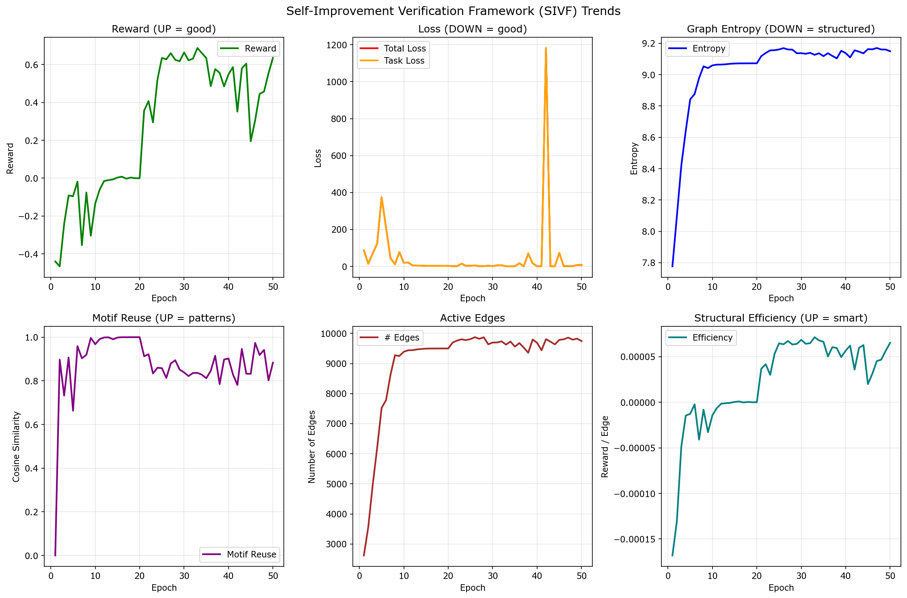

# SRCG: Self-Reflexive Cognitive Graph

A neural architecture that dynamically modifies its graph structure based on task performance, enabling self-improvement through reward-modulated structural plasticity.

## Overview

SRCG (Self-Reflexive Cognitive Graph) is a novel neural system that combines:
- **Gradient-based learning** for node parameters
- **Non-gradient structural plasticity** for graph topology
- **Reward-driven adaptation** that modifies connections based on task success

Unlike traditional neural networks with fixed architectures, SRCG's graph structure evolves during training, allowing it to self-organize and adapt to increasingly complex tasks.

## Key Features

### 1. Dynamic Graph Structure
The adjacency matrix (edge weights) is not learned via gradients but updated through reward-modulated plasticity rules. Edges are added, pruned, and strengthened based on:
- Node activation correlations
- Task reward signals
- Structural efficiency metrics

### 2. Stable Message Passing
Damped iterative reasoning prevents instability:

$$H_{t+1} = (1-\alpha) H_t + \alpha \text{ReLU}(H_t W_{\text{self}} + A^T H_t)$$

Where $\alpha = 0.5$ provides stable convergence.

### 3. Dual Learning Mechanism
- **Gradient-based**: Node transformation matrices and output head
- **Plasticity-based**: Graph structure (edges) via Hebbian-reward updates

### 4. Self-Improvement Verification Framework (SIVF)
Built-in metrics to empirically validate self-organization:
- **Graph Entropy**: Measures structural organization
- **Motif Reuse**: Tracks pattern learning and stability
- **Structural Efficiency**: Reward per edge (intelligence density)

## Architecture

```
                    ┌─────────────┐
                    │   Input     │
                    │  Encoder    │
                    └──────┬──────┘
                           │
                    ┌──────▼──────┐        ┌───────────────┐
                    │   SRCG      │◄───────►│  Structural  │
                    │ Core Graph  │ Reward  │   Policy     │
                    │ (Reasoning) │         │ (Plasticity) │
                    └──────┬──────┘         └──────────────┘
                           │
                    ┌──────▼──────┐
                    │   Output    │
                    │    Head     │
                    └─────────────┘
```

## Installation

```bash
# Clone repository
git clone <repository-url>
cd SRCG

# Install dependencies
pip install -r requirements.txt
```

**Requirements:**
- Python 3.8+
- PyTorch 2.0+
- NumPy, PyYAML, Matplotlib, tqdm

## Quick Start

### Basic Training

```bash
# Train with default synthetic dataset
python train.py --config config.yaml --output-dir ./outputs

# Train with hierarchical progressive difficulty
python train.py --dataset hierarchical --progressive
```

### Programmatic Usage

```python
from srcg import SRCG
import torch

# Initialize model
model = SRCG(
    input_dim=32,
    output_dim=1,
    num_nodes=100,
    node_dim=128,
    reasoning_steps=20,
)

# Forward pass
x = torch.randn(batch_size, 32)
y_pred, info = model(x)

# Access graph structure
num_edges = model.get_num_edges()
adjacency = model.A  # [N, N] tensor
```

## Empirical Validation

### Self-Improvement Results

Training on the HierarchicalPatternDataset demonstrates clear self-improvement:



**Key Observations:**
1. **Reward**: Transitions from negative (-0.44) to strongly positive (+0.64)
2. **Entropy**: Stabilizes after initial exploration phase
3. **Motif Reuse**: Maintains high similarity (>0.85) indicating learned patterns
4. **Efficiency**: Turns positive, indicating smarter connections per edge

### Training Phases

| Phase | Epochs | Characteristics | Graph Behavior |
|-------|--------|-----------------|----------------|
| **Exploration** | 1-10 | Negative rewards, high instability | Rapid edge growth (2k → 9k) |
| **Stabilization** | 10-20 | Rewards approach zero, structure settles | Edges stabilize (~9.5k) |
| **Self-Organization** | 20-30 | Positive rewards, entropy flattens | Efficiency increases |
| **Adaptation** | 30-50 | Sustained performance, level adaptation | Structure optimized |

### Progressive Difficulty Adaptation

The model successfully adapts to increasing task complexity:

- **Level 1** (Epochs 1-10): Simple sum → learned
- **Level 2** (Epochs 11-20): Alternating sum → adapted within 2-3 epochs
- **Level 3** (Epochs 21-30): Parity detection → adapted, peak performance
- **Level 4** (Epochs 31-50): Threshold logic → maintained high performance

## Configuration

Key hyperparameters in `config.yaml`:

```yaml
SRCG:
  num_nodes: 100              # Graph size
  dim: 128                    # Node hidden dimension
  reasoning_steps: 20         # Message passing iterations
  alpha_damping: 0.5          # Damping coefficient
  w_max: 0.1                  # Edge weight clipping bound
  prune_threshold: 0.02       # Edge pruning threshold
  add_threshold: 0.8          # Edge addition threshold (cosine similarity)
  enable_sivf: true           # Enable self-improvement metrics
```

## Hardware Requirements

SRCG is designed for accessibility:

- **CPU**: Modern laptop (Intel i5/i7, AMD Ryzen) - ~5-10 min for 50 epochs
- **GPU**: Optional, consumer-grade (GTX 1650+) - ~1-3 min for 50 epochs
- **Memory**: < 1 GB RAM
- **Storage**: < 100 MB

**Why lightweight?**
- Small model: ~0.4M parameters
- Synthetic datasets: 32-D vectors
- Research focus: Validation over scale

## Datasets

### SyntheticDataset
Baseline regression task for stability testing:

$$y = \sin\left(\sum_{i=0}^{15} x_i\right) + \cos\left(\sum_{i=16}^{31} x_i\right)$$

### HierarchicalPatternDataset
Progressive difficulty curriculum:
- **Level 1**: Simple sum
- **Level 2**: Alternating sum (+ - + -)
- **Level 3**: Parity detection
- **Level 4**: Threshold logic

Use with `--progressive` flag for automatic curriculum learning.

## Project Structure

```
SRCG/
├── srcg/
│   ├── __init__.py          # Package exports
│   ├── model.py             # Core SRCG implementation
│   ├── train.py             # Training loop and utilities
│   ├── data.py              # Dataset implementations
│   └── sivf.py              # Self-Improvement Verification Framework
├── docs/
│   └── sivf_trends.png      # Validation results visualization
├── train.py                 # Main training entry point
├── validate_sivf.py         # Standalone validation script
├── regenerate_plot.py        # Plot regeneration utility
├── config.yaml              # Configuration file
├── requirements.txt        # Python dependencies
└── README.md               # This file
```

## Research Contributions

### Novel Aspects

1. **Self-Modifying Architecture**: Graph structure changes during training based on reward
2. **Dual Learning**: Simultaneous gradient-based and plasticity-based updates
3. **SIVF Framework**: Empirical validation methodology for self-improvement
4. **Reward-Modulated Plasticity**: Hebbian learning driven by task success

### Validation

The SIVF framework provides quantitative evidence of self-improvement:
- Reward progression from negative to positive
- Entropy stabilization indicating organization
- High motif reuse demonstrating learned patterns
- Positive efficiency showing intelligent structure

## Results Summary

Training over 50 epochs with progressive difficulty shows:

- ✅ **Reward**: -0.44 → +0.64 (strong positive trend)
- ✅ **Efficiency**: -0.000168 → +0.000065 (turned positive)
- ✅ **Structure**: Stabilized at ~9.7k edges with high reuse (0.88)
- ✅ **Adaptation**: Successfully adapted to 4 difficulty levels

## Citation

If you use SRCG in your research, please cite:

```bibtex
@software{srcg2024,
  title={SRCG: Self-Reflexive Cognitive Graph},
  author={[Your Name]},
  year={2024},
  url={[Repository URL]}
}
```

## License

[Specify your license]

## Acknowledgments

- Inspired by graph neural networks and neuroplasticity principles
- Built on PyTorch
- SIVF framework for empirical validation

---

**Status**: Research prototype - validated on synthetic tasks. Extensions to real-world datasets are ongoing.
